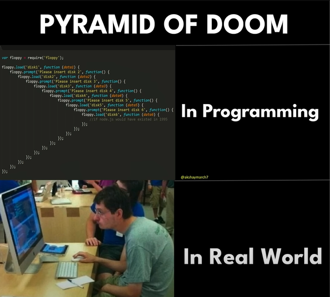

# Callbacks in JavaScript

## What is a Callback?
A **callback** is a function passed as an argument to another function, which is then executed inside the outer function to complete some kind of routine or action. Callbacks are a way to make sure certain code doesn’t execute until another piece of code has finished executing.

```javascript
function greet(name, callback) {
  console.log(`Hello, ${name}`);
  callback();
}

function sayGoodbye() {
  console.log("Goodbye!");
}

greet("Alice", sayGoodbye);
```

## Use Cases of Callbacks
1. **Asynchronous Operations**: Callbacks are widely used in asynchronous programming, such as handling API calls, file reading, or database queries.
2. **Event Handling**: Used in event-driven programming, such as handling user interactions in the browser.
3. **Custom Iterators**: Callbacks are used in array methods like `map`, `filter`, and `forEach`.
4. **Middleware in Frameworks**: Frameworks like Express.js use callbacks for middleware functions.

## Pros and Cons of Callbacks

### Pros:
- **Asynchronous Execution**: Enables non-blocking code execution.
- **Code Reusability**: Functions can be reused as callbacks in different contexts.
- **Flexibility**: Allows passing custom logic to functions.

### Cons:
- **Callback Hell**: Excessive nesting of callbacks can make code difficult to read and maintain.
- **Error Handling**: Managing errors in deeply nested callbacks can be challenging.
- **Debugging Difficulty**: Tracing issues in callback-heavy code can be harder.

## The Pyramid of Doom
The **Pyramid of Doom** refers to the deeply nested structure of callbacks, which makes the code hard to read and maintain.

```javascript
doSomething(function(result) {
  doSomethingElse(result, function(newResult) {
    doAnotherThing(newResult, function(finalResult) {
      console.log(finalResult);
    });
  });
});
```



### Solution: Use Promises or Async/Await
To avoid the Pyramid of Doom, you can use Promises or `async/await` syntax.

```javascript
doSomething()
  .then(doSomethingElse)
  .then(doAnotherThing)
  .then(console.log)
  .catch(console.error);
```

## Lesser-Known Facts About Callbacks
1. **Synchronous vs Asynchronous Callbacks**: Not all callbacks are asynchronous. For example, `Array.prototype.forEach` uses synchronous callbacks.
2. **Closures**: Callbacks often rely on closures, which can lead to memory leaks if not handled properly.
3. **Context Binding**: The value of `this` inside a callback may not always be what you expect. Use `.bind()` or arrow functions to fix this.
4. **Callback Queue**: In JavaScript, asynchronous callbacks are queued in the **Event Loop**, which ensures non-blocking execution.

## Conclusion
Callbacks are a fundamental concept in JavaScript, enabling asynchronous programming and event-driven architectures. While they are powerful, developers should be cautious of pitfalls like callback hell and ensure proper error handling. Modern alternatives like Promises and `async/await` provide cleaner and more maintainable solutions.
