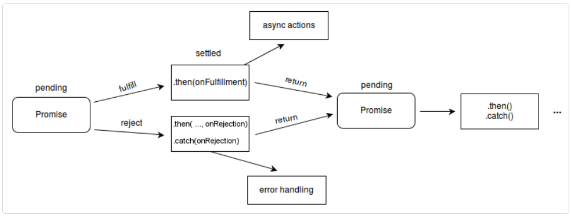

# Promises in JavaScript

## Overview

Promises in JavaScript are objects that represent the eventual completion (or failure) of an asynchronous operation and its resulting value. They provide a cleaner, more robust way to handle asynchronous operations compared to traditional callback-based approaches.



### States of a Promise

A `Promise` can be in one of the following states:

- **Pending**: The initial state of the promise. The operation has not yet completed, and the result is not yet available.
- **Fulfilled**: The operation was completed successfully, and the promise has a resulting value.
- **Rejected**: The operation failed, and the promise has a reason for the failure.

### Why Use Promises?

Promises help manage asynchronous code in a more readable and maintainable way. They allow you to:

1. Avoid "callback hell" by chaining `.then()` calls.
2. Handle errors more effectively using `.catch()`.
3. Combine multiple asynchronous operations using `Promise.all()` or `Promise.race()`.

### Basic Syntax

Here’s an example of creating and using a promise:

```javascript
const myPromise = new Promise((resolve, reject) => {
  let success = true;

  if (success) {
    resolve("Operation successful!");
  } else {
    reject("Operation failed!");
  }
});

myPromise
  .then((value) => {
    console.log(value); // Logs: "Operation successful!"
  })
  .catch((error) => {
    console.error(error); // Logs: "Operation failed!" if rejected
  });
```

### Chaining Promises

Promises can be chained to perform a sequence of asynchronous operations:

```javascript
fetch("https://api.example.com/data")
  .then((response) => response.json())
  .then((data) => {
    console.log("Data received:", data);
  })
  .catch((error) => {
    console.error("Error:", error);
  });
```

### Combining Promises

You can use `Promise.all()` to wait for multiple promises to resolve:

```javascript
const promise1 = Promise.resolve(10);
const promise2 = Promise.resolve(20);
const promise3 = Promise.resolve(30);

Promise.all([promise1, promise2, promise3])
  .then((values) => {
    console.log(values); // Logs: [10, 20, 30]
  })
  .catch((error) => {
    console.error("Error:", error);
  });
```

Alternatively, use `Promise.race()` to get the result of the first promise that resolves or rejects:

```javascript
const promiseA = new Promise((resolve) => setTimeout(resolve, 100, "A"));
const promiseB = new Promise((resolve) => setTimeout(resolve, 200, "B"));

Promise.race([promiseA, promiseB]).then((value) => {
  console.log(value); // Logs: "A"
});
```

### Error Handling

Graceful error handling is crucial when working with promises to ensure your application remains robust and user-friendly. Here are some best practices and benefits:

#### Best Practices for Error Handling

1. **Use `.catch()` for Errors**: Always attach a `.catch()` to handle promise rejections.
2. **Chain `.catch()` Appropriately**: Place `.catch()` at the end of a promise chain to handle errors from any step in the chain.
3. **Use `finally` for Cleanup**: Use `.finally()` to execute code that should run regardless of the promise's outcome, such as closing resources or resetting states.
4. **Avoid Silent Failures**: Log or display errors to ensure they are not ignored.

#### Example of Graceful Error Handling

```javascript
fetch("https://api.example.com/data")
  .then((response) => {
    if (!response.ok) {
      throw new Error(`HTTP error! status: ${response.status}`);
    }
    return response.json();
  })
  .then((data) => {
    console.log("Data received:", data);
  })
  .catch((error) => {
    console.error("Error occurred:", error.message);
  })
  .finally(() => {
    console.log("Operation completed.");
  });
```

#### Why Handle Errors Gracefully?

1. **Improved User Experience**: Prevents abrupt application crashes and provides meaningful feedback to users.
2. **Debugging and Maintenance**: Makes it easier to identify and fix issues in your code.
3. **Resilience**: Ensures your application can recover from unexpected failures without compromising functionality.

By adopting these practices, you can write more reliable and maintainable asynchronous code.

Promises provide a `.catch()` method to handle errors:

```javascript
const faultyPromise = new Promise((_, reject) => {
  reject("Something went wrong!");
});

faultyPromise
  .then((value) => {
    console.log(value);
  })
  .catch((error) => {
    console.error("Caught error:", error); // Logs: "Caught error: Something went wrong!"
  });
```

### Conclusion

Promises are a powerful tool for managing asynchronous operations in JavaScript. They make code easier to read, maintain, and debug. For more advanced use cases, consider exploring `async/await`, which builds on promises to provide a more synchronous-looking syntax for asynchronous code.

For further reading, refer to the [MDN Web Docs: Promise](https://developer.mozilla.org/en-US/docs/Web/JavaScript/Reference/Global_Objects/Promise).
